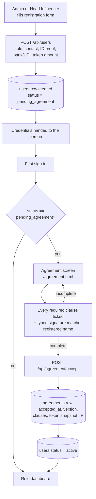
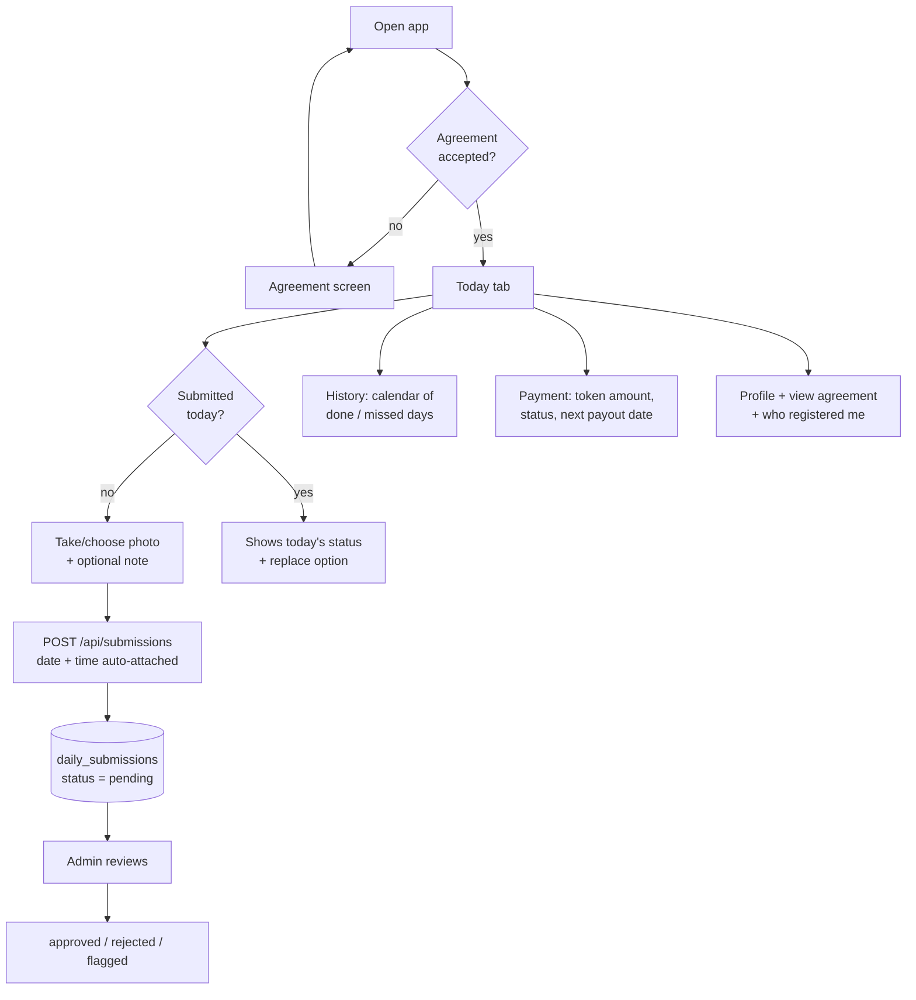
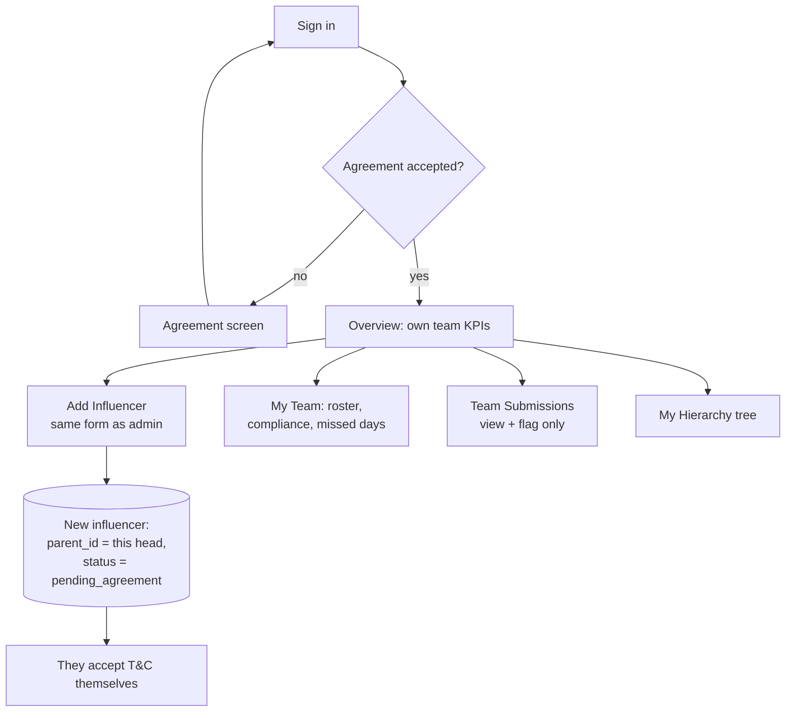
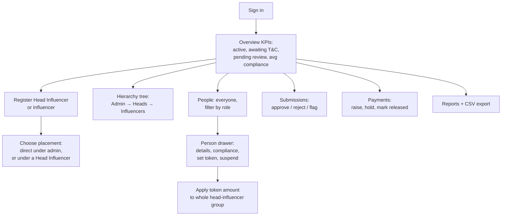
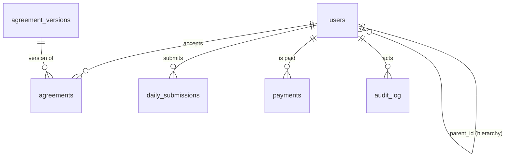

# QHT Influencer Management — Design

Multi-level influencer programme: **QHT Admin → Head Influencer → Influencer**.
Influencers consume the product ("dava") daily and submit a photo as proof; QHT pays a fixed
token amount per cycle, subject to compliance.

---

## 1. Roles and what each one can do

| Capability | QHT Admin | Head Influencer | Influencer |
|---|:--:|:--:|:--:|
| Register Head Influencers | ✅ | ❌ | ❌ |
| Register Influencers | ✅ | ✅ (under themselves) | ❌ |
| See full hierarchy | ✅ all | ✅ own downline only | ❌ |
| Set / edit token amount | ✅ | ❌ (read-only) | ❌ |
| Approve / reject submissions | ✅ | ❌ (may **flag** only) | ❌ |
| See team submissions & compliance | ✅ all | ✅ own team | own only |
| Release payments | ✅ | ❌ | ❌ |
| Reports & CSV export | ✅ | ❌ | ❌ |
| Upload daily proof photo | ❌ | ❌ | ✅ |
| View own accepted agreement | — | ✅ | ✅ |

A Head Influencer **never** sees another Head Influencer's team. Scoping is enforced
server-side by a recursive descendant query, not in the UI.

---

## 2. Registration + agreement acceptance flow

This is the gate that every non-admin account passes through exactly once.



**The gate is enforced in three independent places** so it cannot be skipped:

1. **UI** — the Accept button stays disabled until all required clauses are ticked *and* the
   typed signature matches the registered name.
2. **Accept endpoint** — re-validates required clauses and the signature server-side.
3. **Every other endpoint** — `requireAgreement` middleware returns **HTTP 428** while
   `status = 'pending_agreement'`, and the client redirects to the agreement screen.

### Clauses presented (agreement v1.0)

| # | Clause | Covers |
|---|---|---|
| 1 | Fixed token amount | QHT pays a fixed amount per cycle |
| 2 | Daily consumption of the product (dava) | The core commitment |
| 3 | Daily photo proof | One photo per day, timestamped automatically |
| 4 | Duration and frequency | 90 days, one submission every calendar day |
| 5 | Consequences of non-compliance | <80% compliance ⇒ payout withheld/reduced/held |
| 6 | Use of submitted photos | Storage and review for verification only |
| 7 | Truthful submissions | Photo taken that day; false proof ⇒ removal |

Clauses are stored as JSON on a **versioned** agreement record, so terms can change without
rewriting history — each acceptance snapshots the version label, the ticked clauses and the
token amount agreed at that moment.

---

## 3. Role flows

### Influencer (daily loop, mobile)



### Head Influencer



### QHT Admin



---

## 4. Screens / wireframes

### Influencer — mobile-first (390px)

```
┌─────────────────────────────┐   ┌─────────────────────────────┐
│ QHT  My Programme  Aarav M. │   │ ‹   September 2026        › │
├─────────────────────────────┤   ├─────────────────────────────┤
│ ╔═════════════════════════╗ │   │  M  T  W  T  F  S  S        │
│ ║ Hello, Aarav            ║ │   │  1✓ 2✓ 3✓ 4✓ 5✓ 6•  7•     │
│ ║ Day 24 of your programme║ │   │  8• 9– 10 11 12 13 14       │
│ ║ 76%    21      6        ║ │   │ ✓ approved  • pending       │
│ ║ compl. sent   missed    ║ │   │ ✕ rejected  – missed        │
│ ╚═════════════════════════╝ │   ├─────────────────────────────┤
│ ┌ ─ ─ ─ ─ ─ ─ ─ ─ ─ ─ ─ ─ ┐ │   │ COMPLIANCE 80%  MISSED 5    │
│         📷                  │   │ APPROVED  17    PENDING 3   │
│   Upload today's proof      │   ├─────────────────────────────┤
│   Take a photo showing      │   │ This month's photos         │
│   you consuming the dava    │   │ ┌────┐┌────┐┌────┐          │
│      [ Upload photo ]       │   │ │IMG ││IMG ││IMG │          │
│ └ ─ ─ ─ ─ ─ ─ ─ ─ ─ ─ ─ ─ ┘ │   │ │08  ││07  ││06  │          │
│ ⚠ Not submitted today yet   │   │ └────┘└────┘└────┘          │
├─────────────────────────────┤   ├─────────────────────────────┤
│ 📷Today 📅History ₹Pay 👤Me │   │ 📷Today 📅History ₹Pay 👤Me │
└─────────────────────────────┘   └─────────────────────────────┘
        Today tab                      History / calendar tab

┌─────────────────────────────┐   ┌─────────────────────────────┐
│ ╔═════════════════════════╗ │   │ Aarav Mehta                 │
│ ║ Token per monthly cycle ║ │   │ [active] Influencer         │
│ ║ ₹5,000                  ║ │   │ Phone           9000000020  │
│ ║ Next payout: 22 Sep     ║ │   │ Registered by   Rohit Sharma│
│ ╚═════════════════════════╝ │   │                 Head Infl.  │
│ ⚠ Compliance 76% — below    │   │ UPI             aarav@upi   │
│   the 80% the agreement     │   ├─────────────────────────────┤
│   requires; payout may hold │   │ My agreement                │
├─────────────────────────────┤   │ [ View accepted agreement ] │
│ Current cycle               │   ├─────────────────────────────┤
│ ₹5,000  25 Aug–22 Sep [pend]│   │ Change password             │
├─────────────────────────────┤   │ [current] [new] [Update]    │
│ Payment history             │   ├─────────────────────────────┤
│ ₹5,000 ref UTR100004 [rel.] │   │ [ Sign out ]                │
└─────────────────────────────┘   └─────────────────────────────┘
        Payment tab                        Profile tab
```

### Agreement acceptance (all new accounts)

```
┌───────────────────────────────────────────────┐
│ QHT Influencer Participation Agreement        │
│ Version v1.0 · 90 days · minimum 80% compl.   │
├───────────────────────────────────────────────┤
│ ╔═══════════════════════════════════════════╗ │
│ ║ Your token amount per payout cycle        ║ │
│ ║ ₹4,000   paid monthly                     ║ │
│ ╚═══════════════════════════════════════════╝ │
│ ℹ Tick every box. You cannot reach your       │
│   dashboard until all terms are accepted.     │
│ ┌───────────────────────────────────────────┐ │
│ │ ☐ 1. Fixed token amount                   │ │
│ │      QHT will pay me a fixed token…       │ │
│ ├───────────────────────────────────────────┤ │
│ │ ☐ 2. Daily consumption of the dava        │ │
│ ├───────────────────────────────────────────┤ │
│ │ ☐ 3. Daily photo proof                    │ │
│ │ ☐ 4. Duration and frequency               │ │
│ │ ☐ 5. Consequences of non-compliance       │ │
│ │ ☐ 6. Use of submitted photos              │ │
│ │ ☐ 7. Truthful submissions                 │ │
│ └───────────────────────────────────────────┘ │
│ Type your full name to sign                   │
│ [_________________________]                   │
│ Registered name: Karan Verma                  │
├───────────────────────────────────────────────┤
│ 0 of 7 accepted                     Sign out  │
│ [        Accept & continue  (disabled)      ] │
└───────────────────────────────────────────────┘
```

### Admin dashboard (desktop)

```
┌──────────────────────────────────────────────────────────────────────────┐
│ QHT Influencer Manager                        QHT Admin      [Sign out]  │
├──────────────────────────────────────────────────────────────────────────┤
│ [Overview] Hierarchy  People  Register  Submissions  Payments  Reports   │
├──────────────────────────────────────────────────────────────────────────┤
│ ┌────────┐┌────────┐┌────────┐┌────────┐┌────────┐┌────────┐┌─────────┐  │
│ │HEADS   ││INFLUEN.││ACTIVE  ││AWAIT   ││SENT    ││NOT YET ││PENDING  │  │
│ │  2     ││  5     ││  4     ││T&C  2  ││TODAY 1 ││TODAY 3 ││REVIEW 8 │  │
│ └────────┘└────────┘└────────┘└────────┘└────────┘└────────┘└─────────┘  │
│ ┌──────────────────────────────────────────────────────────────────────┐ │
│ │ Payout position                                          scope: all  │ │
│ │  TOTAL ₹56,000   RELEASED ₹20,500   OUTSTANDING ₹35,500   MISSED 29  │ │
│ └──────────────────────────────────────────────────────────────────────┘ │
│ ┌──────────────────────────────────────────────────────────────────────┐ │
│ │ Below the 80% compliance floor                                       │ │
│ │ Vikram Singh   ▓▓▓▓░░░░░░ 37.5%   10 missed            [View]        │ │
│ │ Priya Nair     ▓▓▓▓▓▓░░░░ 61.9%    8 missed            [View]        │ │
│ └──────────────────────────────────────────────────────────────────────┘ │
└──────────────────────────────────────────────────────────────────────────┘

Hierarchy tab                          Submissions tab
┌──────────────────────────────┐       ┌──────────────────────────────────┐
│ ■ QHT Admin        [admin]   │       │ [Pending ▾] [date] [Clear]       │
│ └─ ▨ Rohit Sharma  [head]    │       │ ┌────────┐┌────────┐┌────────┐   │
│    ├─ □ Aarav Mehta 76% ·6   │       │ │ PHOTO  ││ PHOTO  ││ PHOTO  │   │
│    ├─ □ Priya Nair  62% ·8   │       │ │Aarav M ││Priya N ││Sneha I │   │
│    └─ □ Karan Verma [await]  │       │ │08 Sep  ││08 Sep  ││07 Sep  │   │
│ └─ ▨ Neha Kapoor   [await]   │       │ │[pending]│[pending]│[pending]│  │
│ ├─ □ Sneha Iyer    78% ·5    │       │ │[✓][✕][⚑]│[✓][✕][⚑]│[✓][✕][⚑]│ │
│ └─ □ Vikram Singh  38% ·10   │       │ └────────┘└────────┘└────────┘   │
└──────────────────────────────┘       └──────────────────────────────────┘

Person drawer (admin controls)         Payments tab
┌──────────────────────────────┐       ┌──────────────────────────────────┐
│ Rohit Sharma      [Close]    │       │ Raise a payout                   │
│ [Head Influencer] [active]   │       │ Person[▾] Amount[ ] Start[] End[]│
│ Phone / Email / Address      │       │ [Raise payout]                   │
│ Registered by  QHT Admin     │       ├──────────────────────────────────┤
│ Token ₹15,000 / monthly      │       │ Person   Period   Amt  Status    │
├──────────────────────────────┤       │ Aarav M  25Aug–22 5,000 [pending]│
│ Admin controls               │       │          Sep            [Release]│
│ Token amount [15000]         │       │ Vikram S 25Aug–22 4,500 [on hold]│
│ Cycle [monthly ▾]            │       │ Priya N  …        5,000 [released]│
│ ☑ Apply to their whole team  │       └──────────────────────────────────┘
│ [Save token amount][Suspend] │
└──────────────────────────────┘
```

### Head Influencer dashboard

Same shell, reduced surface — tabs are `Overview · My Team · Add Influencer ·
Team Submissions · My Hierarchy`. No Payments tab, no Reports tab, token amount fields are
disabled, and the submission cards offer **Flag** only (no approve/reject).

---

## 5. Database schema



### `users` — one self-referencing table holds the whole hierarchy

| Column | Type | Notes |
|---|---|---|
| `id` | INTEGER PK | |
| `role` | TEXT | `admin` \| `head_influencer` \| `influencer` |
| `parent_id` | INTEGER FK → users.id | **who registered them**; NULL for admin |
| `full_name`, `phone`, `email`, `address` | TEXT | `phone`/`email` unique |
| `id_proof_type`, `id_proof_number`, `id_proof_file` | TEXT | uploaded doc path |
| `bank_account_name`, `bank_account_no`, `bank_ifsc`, `upi_id` | TEXT | payout details |
| `password_hash` | TEXT | scrypt |
| `status` | TEXT | `pending_agreement` \| `active` \| `suspended` |
| `token_amount` | REAL | payout per cycle |
| `payout_cycle` | TEXT | `weekly` \| `fortnightly` \| `monthly` |
| `next_payout_date` | TEXT | |

`parent_id` is the whole hierarchy. A Head Influencer's team is
`WITH RECURSIVE` over `parent_id`; the same query drives the org chart and every
"can this person see that person" check.

### `agreement_versions` — versioned T&C

`id`, `version` (unique, e.g. `v1.0`), `title`, `summary`, `clauses_json`
(`[{key,title,body,required}]`), `duration_days`, `min_compliance`, `is_active`.

### `agreements` — one acceptance record per user per version

`id`, `user_id`, `version_id`, `version_label`, `accepted_at`, `signature_name`,
`accepted_clauses` (JSON), `token_amount_snap`, `ip_address`, `user_agent`.
Unique on `(user_id, version_id)`. This is the compliance evidence trail.

### `daily_submissions` — the daily photo proof

`id`, `user_id`, `submission_date` (`YYYY-MM-DD`), `photo_path`, `note`, `captured_at`,
`status` (`pending`/`approved`/`rejected`/`flagged`), `reviewed_by`, `reviewed_at`,
`review_note`. **Unique on `(user_id, submission_date)`** — one proof per day; re-uploading
the same day replaces the photo and resets it to `pending` (unless already approved).

### `payments` — token payouts

`id`, `user_id`, `period_start`, `period_end`, `amount`, `compliance_pct`,
`status` (`pending`/`on_hold`/`released`), `released_at`, `released_by`, `reference_no`, `note`.

### `audit_log`

`actor_id`, `action`, `entity`, `entity_id`, `meta`, `created_at` — records registrations,
agreement acceptances, reviews and payout changes.

### Compliance calculation

```
daysActive     = days since agreement acceptance (inclusive)
counted        = approved + pending submissions      (unreviewed still counts as submitted)
missedDays     = daysActive − counted                (rejected days count as missed)
compliancePct  = counted / daysActive × 100
```

Only `active` influencers enter the averages — someone who has not yet accepted their
agreement has not started, so they neither raise nor drag the programme's numbers.

---

## 6. API surface

| Method & path | Who | Purpose |
|---|---|---|
| `POST /api/auth/login` | all | returns token + `needsAgreement` |
| `GET /api/auth/me` | all | profile + who registered them |
| `POST /api/auth/change-password` | all | |
| `GET /api/agreement/current` | non-admin | active version + clause checklist |
| `POST /api/agreement/accept` | non-admin | validates clauses + signature, activates |
| `GET /api/agreement/mine` | all | view accepted agreement any time |
| `POST /api/users` | admin, head | register (multipart: ID proof) |
| `GET /api/users` | admin, head | scoped roster + compliance |
| `GET /api/users/tree` | admin, head | org chart |
| `GET /api/users/:id` | scoped | profile + compliance |
| `PATCH /api/users/:id/token` | admin | set amount, optional cascade to team |
| `PATCH /api/users/:id/status` | admin | suspend / reactivate |
| `POST /api/submissions` | influencer | daily photo (multipart) |
| `GET /api/submissions/mine` | influencer | calendar + compliance |
| `GET /api/submissions` | admin, head | review queue, scoped |
| `PATCH /api/submissions/:id/review` | admin (head: flag only) | approve/reject/flag |
| `GET /api/payments/mine` | influencer | token status, next payout |
| `POST /api/payments` | admin | raise a payout |
| `PATCH /api/payments/:id` | admin | release / hold |
| `GET /api/reports/summary` | admin, head | KPIs, scoped |
| `GET /api/reports/export.csv` | admin, head | compliance export |
| `GET /media/:kind/:file` | owner + upline | **authenticated** photo access |

Proof photos are never public: `/media/...` requires a token and checks that the requester is
the owner or above them in the hierarchy.

---

## 7. Notes for production

The build runs locally as-is. Before it goes anywhere real:

- **`SESSION_SECRET`** — currently falls back to a dev default; set it in the environment.
- **Photo storage** — local `uploads/`; move to object storage (S3/GCS) with signed URLs.
- **Rate limiting + lockout** on `/api/auth/login`.
- **PII at rest** — ID proof numbers and bank details are stored in clear; encrypt them.
- **Payout automation** — payments are raised manually; a scheduled job could open each cycle
  and pre-compute `compliance_pct` against the 80% floor.
- **Notifications** — a daily reminder (SMS/WhatsApp) to influencers who have not submitted
  would directly lift compliance.
- **Medical/consent review** — the agreement text ships as a placeholder covering the points
  requested; it should be reviewed by QHT's legal and clinical teams before real use,
  particularly the wording around daily consumption of a product.
